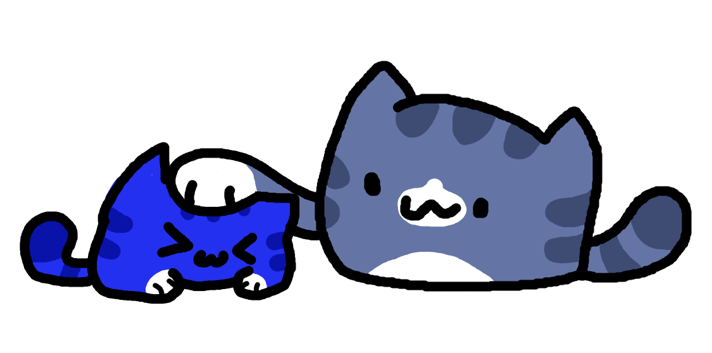

<br>

<figcaption align="center"><q>Good bot</q> - CatNowBlue</figcaption>
<h1 align="center"> CatNowBot - codename "Jolly" </h1>

<p align="center">
  <a href="https://github.com/raluvy95/jolly/blob/main/LICENSE" alt="License"></img></a>
  <a href="https://discord.gg/3CVqX5bphG" alt="Discord"></img></a>
  <a href="https://github.com/raluvy95/jolly/issues" alt="Issues"></img></a>
  <a href="https://github.com/raluvy95/jolly/actions/workflows/deno.yml" alt="Lint status"></a>
</p>
A discord bot designed for my server (private bot). Rewritten in
TypeScript using Deno. Its predecessor can be found in
<a href="https://github.com/raluvy95/maffin">another repository</a>

You can contribute whatever you want to improve the bot with additional features
bug fixes.
<br>
<br>

# Features

Some of these features can be configured with `config.json`

- Auto create channel when someone mentions non-existent channel (including
  private channel)
- Autopost from subreddit (great if you want to setup automeme in funny meme
  channel)
- Autopublish in announcements channel so you don't have to press publish button
  ever again
- Autoroles with membership screening support
- Bump reminder
  - Gets 100 XP reward if someone bumps the server
- Ghost ping - The bot will notice when someone removed mentions of user.
- Level system (way better than MEE6's paywall role rewards)
- Multiple prefixes
- Music support (disabled by default due to stability issues)
  - Requires to add --unstable in `deno.jsonc`
- Warning system + autosentence
- and much more!

# Build the bot and self-host

All you need is to have latest version of [git](https://git-scm.com/) and
[deno](https://deno.land/) installed on your system<br> **Step 1**: Clone this
repository `git clone https://github.com/raluvy95/jolly.git`<br> **Step 2**:
Rename `config-temp.json` to `config.json` and complete there<br> **Step 3**:
Open a terminal<br> **Step 4**: Run the bot with `deno task run`

# How to keep your bot online 24/7 (for who has vps with access to ssh)

You can use any tools for virtual sessions. I recommend `screen` because it is
included in major Linux distros.

If you have `screen` in your server. Great!

Use this following command to start a new session called `jolly`

```bash
screen -S jolly -m deno task run
```

_you can return back to main session with [Ctrl+A] + D_

To list of sessions, type `screen -ls`<br> To reconnect to virtual session, type
`screen -r <session>`.<br> Exanple `screen -r jolly`

# Advantages of Jolly over Maffin

- Jolly is rewritten in TypeScript which takes fixing runtime errors more
  seriously. So no more unexpected crash and no more random TypeErrors
- No more insane breaking changes from Discord API library
- Has its own command handler, embed, utils and more
- With Deno, there's no node_modules folder either.

# License

This bot is licensed under GPL version 3.
